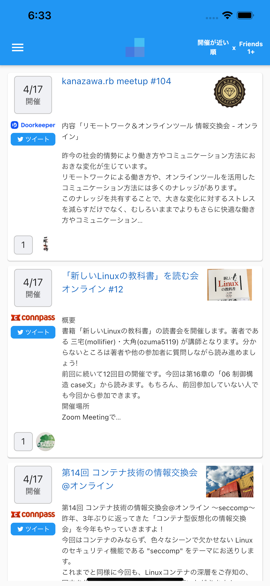
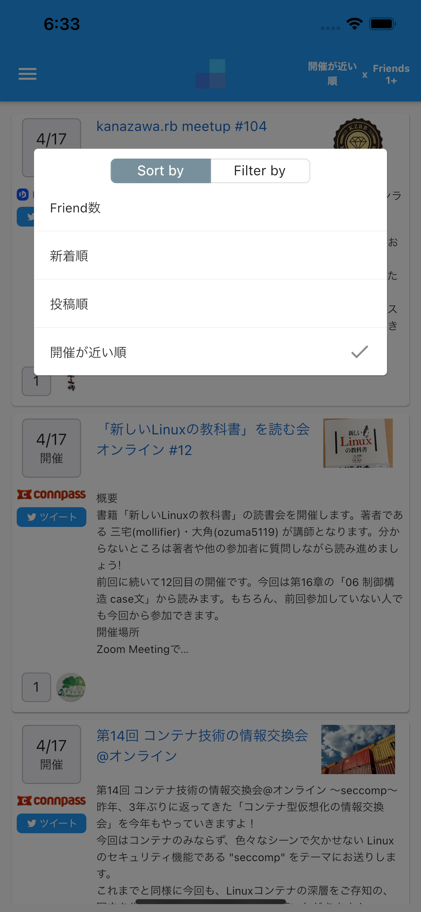
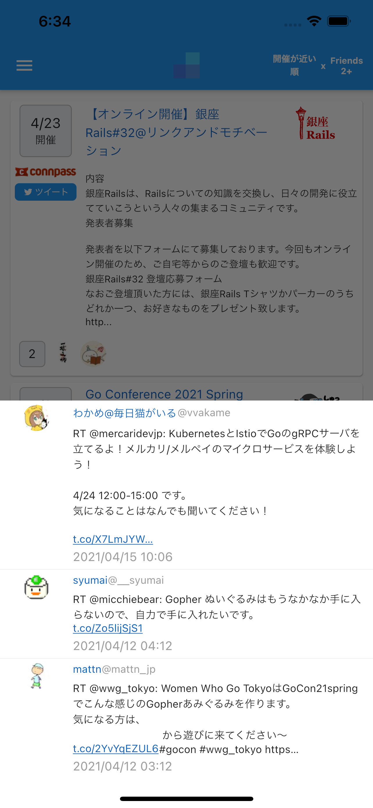

[mh-mobile/event_follow](https://github.com/mh-mobile/event_follow)のモバイルアプリ版です。

 [](https://apps.apple.com/jp/app/event-follow/id1561648565)

# イベントフォロー

   [](https://opensource.org/licenses/MIT)

イベントフォローは、自分の興味の方向に近い技術イベントを見逃してしまう問題を解決したい、技術イベント発見サービスです。ユーザーは Twitterの友達がシェアしたDoorkeeper、connpassのイベントを発見することができ、キーワードで検索することとは違い、検索せずに自分の興味の方向に近いイベントを発見できることが特徴です。

# 機能一覧

### イベント一覧の表示

* Twitterでフォローしたユーザー（以下、友達)が投稿したイベント情報を表示します。
* イベント一覧のリクエストで最大10件のイベント情報を取得します。
* イベント一覧の最下部にスクロールした際に、未取得のイベント情報がある場合は追加読み込みを行います。

### イベントのソート機能

* 以下の４つの種別にもとづきソートできます。
  * Friend数
  * 新着順
  * 投稿順
  * 開催が近い順

### イベントの絞り込み機能
* Friend数のソートを選択した場合、以下の９つの時間軸の種別にもとづき絞り込みできます。
  * 過去8時間
  * 過去24時間
  * 過去2日
  * 過去3日
  * 過去4日
  * 過去5日
  * 過去6日
  * 過去1週間
  * All
* Friend数以外のソートを選択した場合、以下の4つのFriend数の種別にもとづき絞り込みできます。
  * Friends 1+
  * Friends 2+
  * Friends 3+
  * Friends 4+
  * Friends 5+

### イベント情報を投稿した友達の一覧の表示

* イベント情報を投稿した友達のアイコンを一覧を一覧表示します。

### イベントを投稿した友達のツイートの表示

* イベント情報を投稿したツイートやリツイート、引用ツイートの内容を時系列順に表示できます。

### Twitterログイン機能

* Twitterのアカウントを使ってログインできます。

# 使用技術

### Dart
### Flutter 2.0.1

- 状態管理アーキテクチャ
  - [Riverpod](https://pub.dev/packages/riverpod)
  - [StateNotifier](https://pub.dev/packages/state_notifier)
  - [Flutter Hooks](https://pub.dev/packages/flutter_hooks)
  - [freezed](https://pub.dev/packages/freezed)


# 開発環境のセットアップ

### リポジトリのclone

```
$ git clone https://github.com/mh-mobile/event_follow_mobile
```

### 環境変数の設定

プロジェクトルートに.envファイルを配置します。

| 環境変数名             | 値                                 | 説明                                      |
| ---------------------- | ---------------------------------- | ----------------------------------------- |
| TWITTER_API_KEY        | ※ アクセストークンの値             | Twitterのアクセストークンの値             |
| TWITTER_API_SECRET_KEY | ※ アクセストークンシークレットの値 | Twitterのアクセストークンシークレットの値 |
| TWITTER_REDIRECT_URI   | eventfollow://                     | Twitterログイン時のリダイレクトURI        |
| API_DOMAIN             | 例) api.example.com                | Webアプリ版のAPIのドメイン                |
| APP_DOMAIN             | 例) example.com                    | Webアプリ版のフロントのドメイン           |

### アプリの起動

```
$ flutter run --debug
```

※ Null Safetyに対応しているため、`--no-sound-null-safety` のオプションは不要


# スクリーンショット







# Author

* [Github](https://github.com/mh-mobile)
* [Qiita](https://qiita.com/mh_mobiler)
* [Twitter](https://twitter.com/mh_mobiler)

# ライセンス

本ソフトウェアは、MITライセンスの元提供されています。

